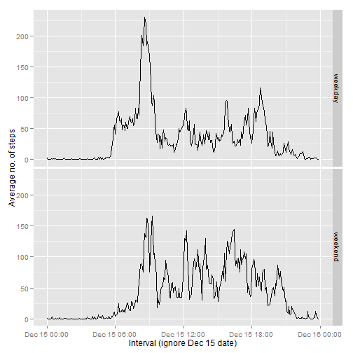

---
<<<<<<< HEAD
title: "Reproducible Research Assignment 1"
author: "Andrea Liang"
date: "Saturday, December 13, 2014"
output: html_document
---

## Loading and pre-processing the data

First, we read the data into R. For ease of further analysis, we include a "datetime" column that combines both the date and the interval. We also change the format of the "interval" column so it can be read as a 'time' variable. 


```r
data <- read.csv("C:/Users/Lenovo/Desktop/Data Science Coursera/5_ProgrammingAssignment1/activity.csv")

data[nchar(data[,3])==1,3] = paste("000", data[nchar(data[,3])==1,3], sep="")
data[nchar(data[,3])==2,3] = paste("00", data[nchar(data[,3])==2,3], sep="")
data[nchar(data[,3])==3,3] = paste("0", data[nchar(data[,3])==3,3], sep="")

library(lubridate)
library(plyr)
library(dplyr)
data <- mutate(data, datetime = paste(date, interval))

data$datetime = ymd_hm(data$datetime)
data$interval <- paste(substr(data$interval, 1, 2), ":", substr(data$interval, 3, 4), sep = "")
data$interval <- strptime(data$interval, format = "%H:%M")
```

## Mean total number of steps per day

Ignoring the missing values in the dataset, we plot a histogram of the total number of steps taken per day. We also calculate the mean and median total steps taken per day. 


```r
totalsteps <- ddply(data, .(date), summarize, sum = sum(steps))
hist(totalsteps$sum, col= "red", breaks = 20, xlab = "Total no. of steps taken a day", main = "Histogram of the Number of Steps Taken a Day", ylim = c(0,20))
```

 

```r
mean(totalsteps$sum, na.rm = TRUE)
```

```
## [1] 10766.19
```

```r
median(totalsteps$sum, na.rm = TRUE)
```

```
## [1] 10765
```

## Average daily activity pattern

The time series plot below shows the average number of steps taken during each 5-minute interval. We see that, on average across all the days in the data set, the time interval where the maximum number of steps takes place is at 0835h. 


```r
averagesteps <- ddply(data, .(interval), summarize, average = mean(steps, na.rm = TRUE))
intmax <- averagesteps[which(averagesteps$average==max(averagesteps$average)),1]
print(intmax)
```

```
## [1] "2014-12-15 08:35:00 MYT"
```

```r
with(averagesteps, plot(interval, average, type = "l", xlab = "Interval", ylab = "Average no. of steps"))
```

 

## Replacing NA values

We see from the data summary that there are 2,304 NA values. 


```r
summary(data)
```

```
##      steps                date          interval                  
##  Min.   :  0.00   2012-10-01:  288   Min.   :2014-12-15 00:00:00  
##  1st Qu.:  0.00   2012-10-02:  288   1st Qu.:2014-12-15 05:58:45  
##  Median :  0.00   2012-10-03:  288   Median :2014-12-15 11:57:30  
##  Mean   : 37.38   2012-10-04:  288   Mean   :2014-12-15 11:57:30  
##  3rd Qu.: 12.00   2012-10-05:  288   3rd Qu.:2014-12-15 17:56:15  
##  Max.   :806.00   2012-10-06:  288   Max.   :2014-12-15 23:55:00  
##  NA's   :2304     (Other)   :15840                                
##     datetime                  
##  Min.   :2012-10-01 00:00:00  
##  1st Qu.:2012-10-16 05:58:45  
##  Median :2012-10-31 11:57:30  
##  Mean   :2012-10-31 11:57:30  
##  3rd Qu.:2012-11-15 17:56:15  
##  Max.   :2012-11-30 23:55:00  
## 
```

We will replace the NA values with the average number of steps taken during that time interval during the other days of the month.  


```r
data$interval <- as.character(data$interval)
newaveragesteps <- ddply(data, .(interval), summarize, average = mean(steps, na.rm = TRUE))
newdata <- join(data, newaveragesteps)
```

```
## Joining by: interval
```

```r
for (i in 1:17568) {
        newdata[i,1] <- replace(newdata[i,1], is.na(newdata[i,1]), newdata[i,5])
        } 
```

We call up the earlier histogram (in red) for comparison, followed by the histogram of the data with the missing values filled in (in blue). We also compare the mean and median total number of steps taken after the missing data have been filled in. We see that the mean value does not change. As we filled in the data with the average no. of steps during the respective time intervals, this means that the missing values are evenly split across all time intervals (i.e. perhaps entire days are missing, rather than just specific times within certain days). The change in the histogram of the total daily number of steps supports this hypothesis, as the number of days that the subject took between 10,000 and 11,000 steps increases by 8. 


```r
totalsteps <- ddply(data, .(date), summarize, sum = sum(steps))
hist(totalsteps$sum, col= "red", breaks = 20, xlab = "Total no. of steps taken a day", main = "Histogram of the Number of Steps Taken a Day", ylim = c(0,20))
```

 

```r
mean(totalsteps$sum, na.rm = TRUE)
```

```
## [1] 10766.19
```

```r
median(totalsteps$sum, na.rm = TRUE)
```

```
## [1] 10765
```


```r
newtotalsteps <- ddply(newdata, .(date), summarize, sum = sum(steps))
hist(newtotalsteps$sum, col= "blue", breaks = 20, xlab = "Total no. of steps taken a day", main = "Histogram of the Number of Steps Taken a Day", ylim = c(0,20))
```

 

```r
mean(newtotalsteps$sum, na.rm = TRUE)
```

```
## [1] 10766.19
```

```r
median(newtotalsteps$sum, na.rm = TRUE)
```

```
## [1] 10766.19
```

## Differences in activity patterns between weekdays and weekends

We create a new factor variable in the dataset to differentiate between weekdays and weekends. The panel plot showing the average number of steps taken at each interval, for weekdays vs. weekends, is below. We see that the subject takes more steps earlier in the day on weekdays than on weekends, and that the peak in the number of steps at about 8 a.m. is attributable largely to his weekday walking pattern. He also takes more steps later in the day on weekends. 


```r
newdata <- mutate(newdata, daytype = "weekday")
for (i in 1:17568) {
        newdata[i,6] <- replace(newdata[i,6], wday(newdata[i,2])==1 | wday(newdata[i,2])==7, "weekend")
}
newdata$daytype <- as.factor(newdata$daytype)

datadaytype <- summarise(group_by(newdata, daytype, interval), avesteps = mean(steps))
datadaytype$interval <- ymd_hms(datadaytype$interval)

library(ggplot2)
qplot(interval, avesteps, data = datadaytype, facets = daytype~., geom = "line", xlab = "Interval (ignore Dec 15 date)", ylab = "Average no. of steps")
```

 
=======
title: "Reproducible Research: Peer Assessment 1"
output: 
  html_document:
    keep_md: true
---


## Loading and preprocessing the data


## What is mean total number of steps taken per day?


## What is the average daily activity pattern?


## Imputing missing values


## Are there differences in activity patterns between weekdays and weekends?
>>>>>>> 80edf39c3bb508fee88e3394542f967dd3fd3270
